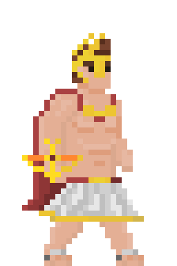
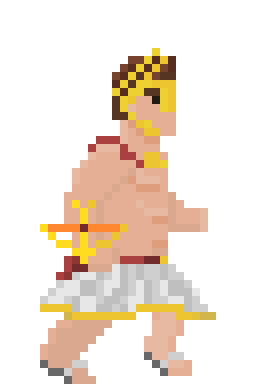
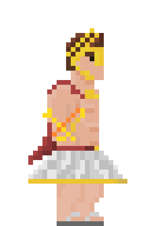
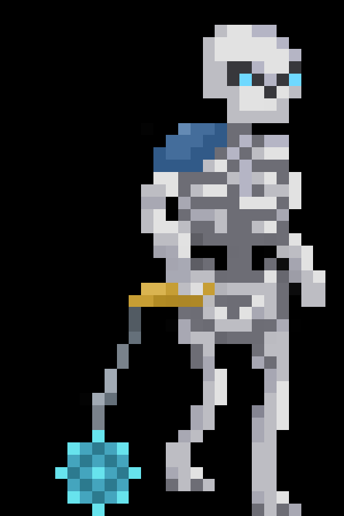
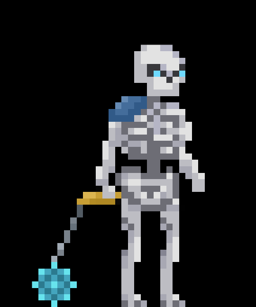
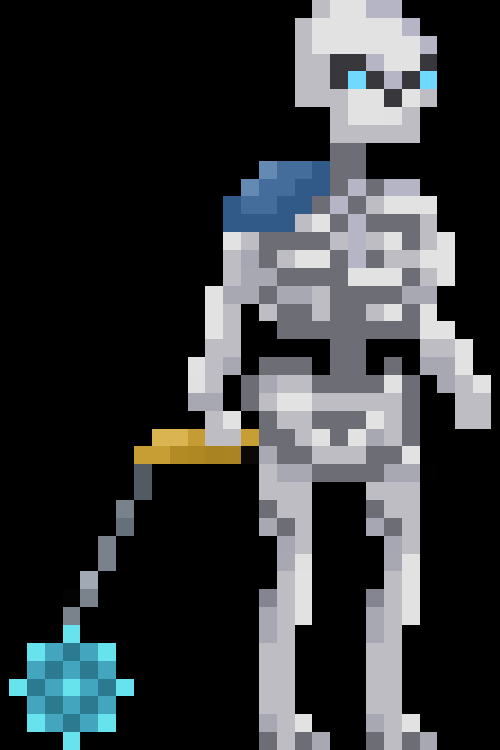
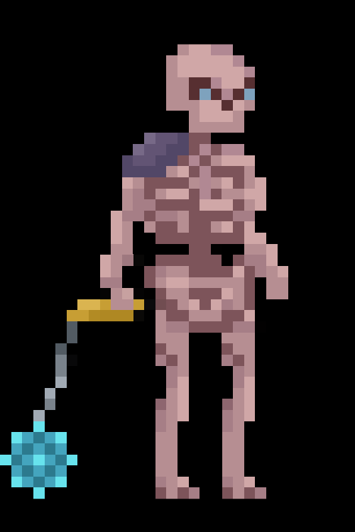
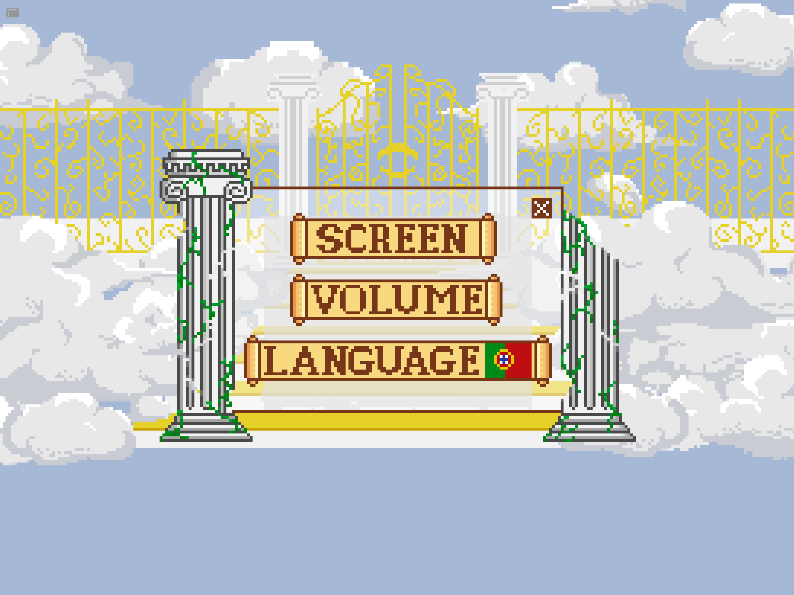
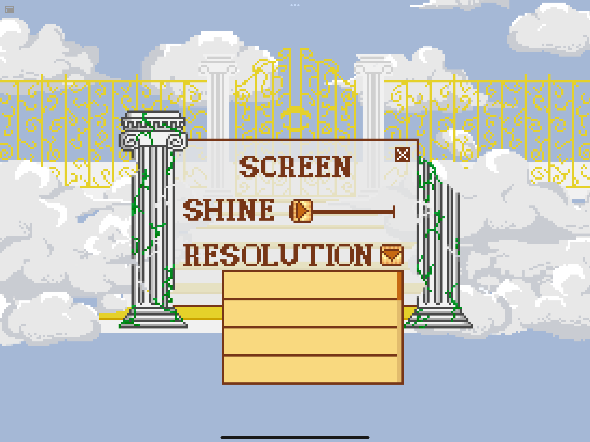
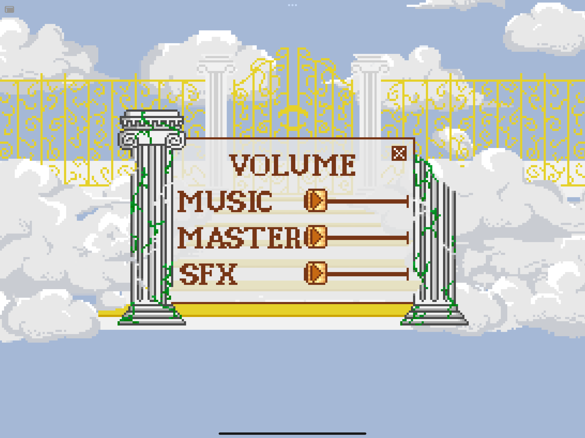

# Art and Style

## Art Moodboard

The general basis of the game's style is Ancient Greece and pop representations of Greek mythology. The game's art is drawn in pixel art.

## The player

The player character only moves sideways, even when moving upwards it appears sideways. It has animations for stopping, running and attacking.
In order to highlight the player's heroism, the character Apollo has several details in gold and an athletic physique. This one has a weapon, a kind of “pulse bow” that shoots energy/fire arrows in individual shots.

### Idle

### Run

### Attacking

## The Enemies

The enemies are various creatures from Asphodel and Tartarus, and therefore, they will be representations of the dead who live there, such as skeletons and specters.

These enemies will have running, attacking and dying animations. They will also always be presented in profile. In order to convey a feeling of “malignancy”, they are based on darker and less contrasting tones.

### Skeleton Enemy

#### Run

#### Attacking

#### Hit

#### Attacking

## The environment

The environment is inspired by Greek mythology and its pop representations. Gold, white and blue are the predominant colors. It will have elements such as marble and tall pillars that refer to Olympus. The lighting will be bright (daytime) and when a boss appears, the scenery will change to something reminiscent of the boss (maybe).

## Map

The map will be a wide square and will not have any colliding objects. The square is surrounded by tall marble pillars, the floor will have a grass pattern, the exit from the square will be to a large gate at the end (the entrance to Olympus)

## UI

The UI
 art of the game it's all in Pixel Art.

### Start Menu

### Pause Menu

### Options Menu

#### Options Menu - Screen Menu

#### Options Menu - Sound Menu
