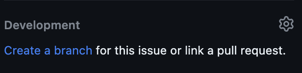

# Project Best Practices

This page will guide you through setting up the project, provide information on branch naming conventions, Godot version compatibility, and an overview of the directory structure. Additionally, we use priority labels to help organize and prioritize tasks. For more conventional best practices please reade this:

- https://docs.godotengine.org/en/stable/tutorials/scripting/gdscript/index.html
- https://docs.godotengine.org/en/stable/tutorials/best_practices/index.html

## Code Styles

- Use `get_node` instead of `$` to get a node from the tree, for example, `@onready var my_node = get_node("MyNode")`, (based: https://github.com/FlamingoFiestaStudio/OlympusGoneWild/pull/26#discussion_r1328143299);
- Variables names should be in snake_case, example: `var my_variable_name: int = 42`;
- Try to implicit all types, for example: `var my_string: string = "My String"`;

## Branch Naming Convention

The branch should have the number of the issue and the title of the issue separated by `-`, for example: `{number of the ticket}-name-of-the-ticket` or `123-my-issue-title`.

To simplify, you could just click here on the issue page, and this will do the magic for you:

## Commit Message Convections

Consistently using this convention ensures clear and structured commit messages, making it easier for team members to understand the purpose of each commit.

`<type>[optional scope]: <description>`

- `<type>`: Describes the purpose or category of the commit;
- `[optional scope]` (optional): Specifies the scope or affected component of the commit or issue number;
- `<description>`: Provides a brief, concise summary of the changes introduced in the commit;

### Commit Types

Choose an appropriate <type> from the following list:

- `feat`: A new feature or enhancement;
- `fix`: A bug fix or correction;
- `docs`: Documentation changes or updates;
- `style`: Code style and formatting improvements (no functional changes);
- `refactor`: Code refactoring, restructuring, or optimizations;
- `chore`: Routine tasks, maintenance, or tooling changes;

### Commit Description

The <description> should be a concise summary of the changes introduced in the commit. Be clear and informative but keep it brief.

### Example Commit Messages

Here are some examples of correctly formatted commit messages:

- `feat(#123): Add a new player bullet.`
- `fix(player): Fix player movimentation issue.`
- `docs(readme): Update installation instructions.`
- `style(main menu): Adjust formatting for consistency.`
- `refactor: Optimize enemy code.`
- `chore: Update dependencies to latest versions.`

## Pull Requests

On creating a pull request, we have a [basic pull request template with some sections](https://github.com/FlamingoFiestaStudio/OlympusGoneWild/blob/main/.github/PULL_REQUEST_TEMPLATE.md), try to fill all of them.

If you don't have nothing to add in the description of some section, please leave as: `N/A.` (Not Applicable).

### Comments Resolution and revisions

When you submit a PR, someone will review your code:

- If that person approves your changes, you did a nice work;
- If that person leaves some comments:
    - If you agree, change what the reviewers said, and notify the person after push;
    - If you do not agree, be nice and explain why do you not think in the same way;
    - The comments should be only closed by the person who left the comment;

## Priority Labels

We use the following priority labels to help organize and prioritize tasks:

- **P1 (Highest Priority)**: Critical tasks or issues that require immediate attention.
- **P2**: High-priority tasks that need to be addressed soon.
- **P3**: Medium-priority tasks that can be scheduled based on the project's needs.
- **P4**: Low-priority tasks or nice-to-have features that can be worked on when time allows.

## Directory Structure

Here's an overview of the project's directory structure:

- `/`: Root directory
- `/entities`: Contains subdirectories for various game entities and characters.
  - `/player`: Contains files related to the player character.
    - `player.tscn`: The scene file for the player character.
    - `player.gd`: The script for the player character.
  - `/enemies`: Contains enemy-related files.
    - `generic_enemy.gd`: Script for a generic enemy.
    - `enemy.tscn`: Base scene for enemies (to be overridden).
    - `boss_enemy.gd`: Script for a boss enemy.
    - `boss.tscn`: Base scene for boss enemies (to be overridden).
  - `actor.tscn`: A scene file for a generic actor.
  - `actor.tres`: A resource file for the actor.
  - `actor.gd`: A script for the actor.
- `/globals`: Contains autoloaded global resources.
  - `notifications.tscn`: Scene for handling notifications.
  - `lobby.tscn`: Scene for the game's lobby.
  - `serialization.tscn`: Scene for handling serialization.
- `/menus`: Contains scenes for standalone 2D menus or popups.
  - `/title`: Subdirectory for title screen-related files.
    - `title.tscn`: Scene for the title screen.
    - `font_title.tres`: Resource file for the title screen's font.
  - `/ui`: Contains UI-related assets that are reused.
    - `/theme_default`: Subdirectory for the default UI theme.
      - `/assets`: Contains UI-related image assets.
      - `theme_default.tres`: Resource file for the default UI theme.
    - `font_uidefault.tres`: Resource file for the default UI font.
    - `cool_font.ttf`: An additional font file.
- `/scenes`: Contains game scenes where players are instantiated.
  - `/common`: Common game scenes and assets.
    - `/assets`: Common assets used in various scenes.
    - `/prefabs`: Premade designs for inclusion in other scenes.
    - `common_gridmap.tres`: Resource file for a common grid map.
  - `/main`: The main game scene and associated assets.
  - `/overworld`: The overworld game scene and assets.
  - `/dungeon`: The dungeon game scene and assets.

## Final notes

Feel free to explore and contribute to the project following the provided directory structure.

If you have any questions or need further assistance, please don't hesitate to reach out to the project team. Happy game development! 🎮🚀